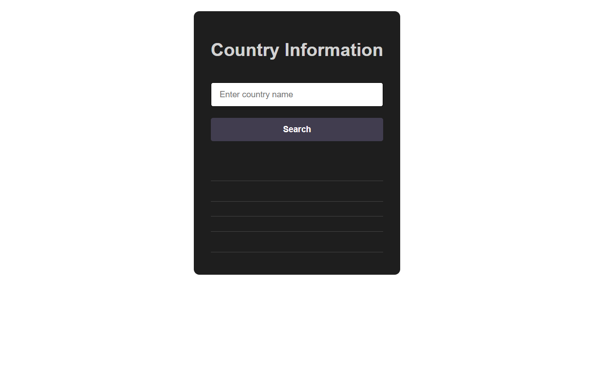

# 🌍 Country Information Finder


[](https://adelsaad99.github.io/country-information-finder/)


A simple and interactive web application that lets you explore essential details about any country in the world.  
Type a country's name, hit **Search**, and instantly get the country's flag, capital, population, and region.  
Clean design with a dark theme makes it easy to use on both desktop and mobile devices.

---

## 🚀 Live Demo
[View Country Information Finder Live](https://adelsaad99.github.io/country-information-finder/)

---

## ✨ Features
- Search for **any country** by name
- Display **flag**, **capital**, **population**, and **region**
- Input validation with friendly error messages
- Interactive **search button** with hover effect
- Clean dark-themed interface
- Responsive design for all screen sizes

---

## 📸 Preview
  


---

## 🛠️ Technologies Used
- **HTML5** → Structure and layout  
- **CSS3** → Styling and responsive design  
- **jQuery 3.7.1** → DOM manipulation and API requests  
- **REST Countries API** → Fetching live country data  

---

## 📂 Project Structure
```bash
country-information-finder/
│
├── index.html          # Main HTML file
├── style.css           # Styling for the app
├── main.js             # jQuery logic for API and interactivity
├── jquery-3.7.1.js     # jQuery library
└── screenshot.png      # Project preview image